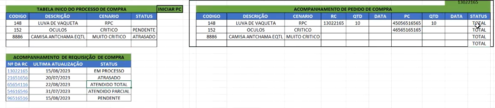
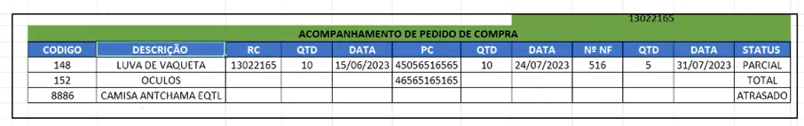

# Almox-Control
## Prioridades
- [ ] Modulo de controle des entrega de epis, epcs, uniformes e ferramentais
- [ ] Modulo de controle de estoque e movimentacoes (transacoes de estoque)

## Secundario
- [ ] controle de vencimentos
- [ ] Relatorios
- [ ] Modulo de compras
## Entregas
- [ ] Criar modal de fornecimento/troca/devolucao de epis e epcs
- [ ] Criar modal de fornecimento/troca/devolucao de uniformes

## Estoque
- [ ] Coluna de cenario de estoque baseado no consumo medio e correlacionado com o pedido de compras
    - [ ] Atende
    - [ ] Regular
    - [ ] Critico
    - [ ] Muito Critico
    - [ ] RPC (Realizar pedido de compra)
- [ ] Adicionar filtros para cada coluna na tabela de estoque
- O filtro de centro é visivel apenas para o usuario com privilegios de administrador
- [ ] Coluna valor -> Valor médio do item
## Movimentações

## Compras
- materiais e servicos
#### O modulo de compras será responsavel por gerenciar as requisicos e pedidos de compra
- No front tabela de acompanhemento de todos itens com os status "critico", "muito critico" e "RPC".
- No front tabela de acompanhamento de todas as requisicoes de compra
- No front dentro da rc uma tabela com o acompanhamento de todos os itens requisitados.
- Deve ter uma tabela propria de rc e pc - db
- Relacionada com o estoque (RPC) - db
- Deve ter um botao para criar requisicao de compra
- cadastrar requisicao de compra
- cadastrar pedidos de compra
- O requisicao de compras pode ter varios pedidos de compras
- A tabela de pc no banco de dados esta relacionada com a tabela de rc - db
- A coluna de status da tabela de rc esta relacionada com
- O status da requisicao de compras só fica como "atendido" quando todos os itens forem atendidos
- O status do pedido está relacionado com a entrada da minha nota fiscal
#### Exemplos:

## Cadastros
#### O modulo de cadastros será responsavel por gerenciar os cadastros de fornecedores, produtos, colaborares, etc

- [ ] Criar cadastro de ghe para cada funcao